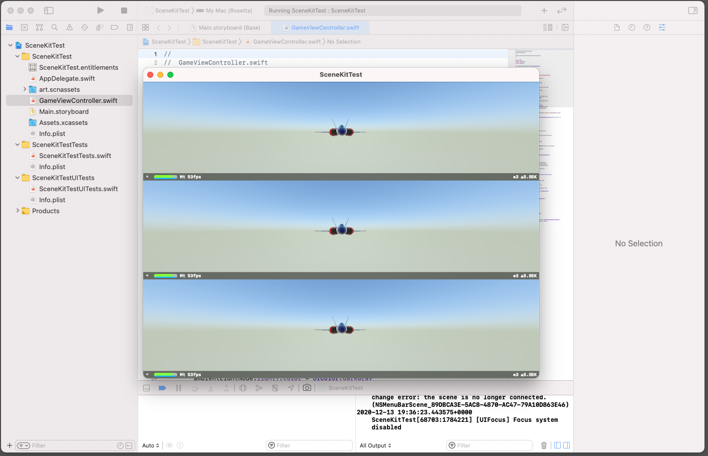
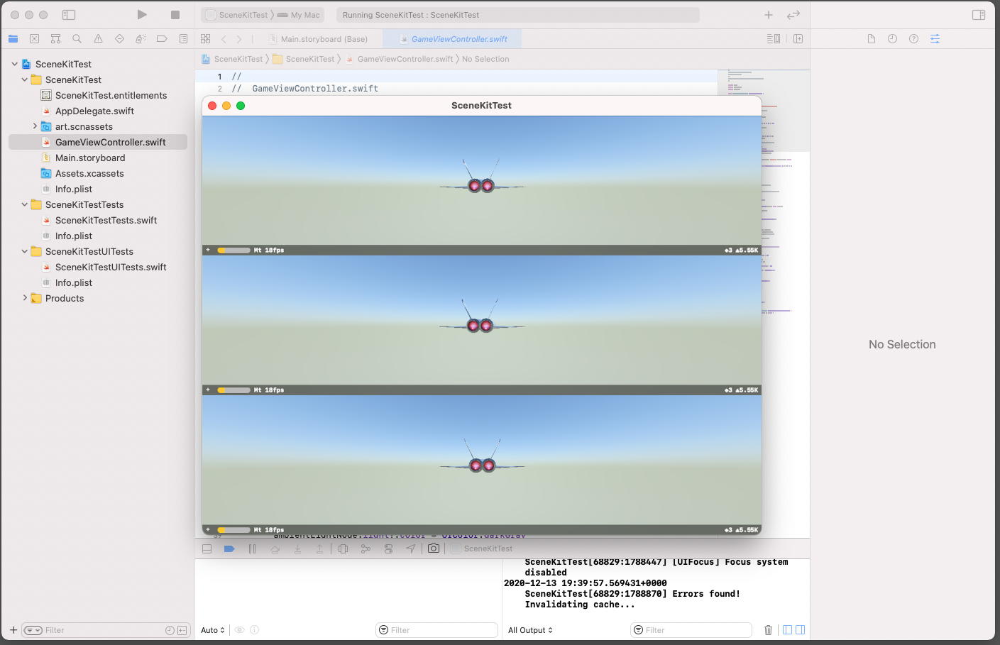

# FB8939087 - SceneKit Performance Severely Drops on Catalyst / M1 Apple Silicon in native mode

## Sample content:
- Default Game Template for iOS, configured with macOS deployment
- Modified Main.storyboard to add 3 times the GameViewController

## Steps to reproduce: 
- build and run the app on M1 chip with target Mac (Rosetta) -> maximum display frame rate obtained in all 3 views

- build the app with target Mac(native) - > frame rate drops on all 3 views to 1/3

* reproducible on M1 mac mini with Big Sur 11.01, 11.1 RC1
